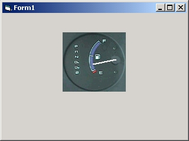



## Fuel Gauge

### Description

This control is just an image of a dashboard fuel gauge with a needle pointing to the percentage done. It's very simple and can be modified to use other images. It has the typical min, max, value properties along with a property for showing the value label. The source is not commented much, but it's mostly self explanatory. I hope you like it, and modify it to suite your needs. PLEASE VOTE, I'd like to continue making more gauges and switches, so inspire me!
 
### More Info
 
Min as Integer

Max as Integer

Value as Integer

ShowValue as Boolean

             |
---                |---
**Submitted On**   |2001-08-30 11:57:32
**By**             |[James W\. Manning](https://github.com/Planet-Source-Code/PSCIndex/blob/master/ByAuthor/james-w-manning.md)
**Level**          |Intermediate
**User Rating**    |4.3 (17 globes from 4 users)
**Compatibility**  |VB 4\.0 \(32\-bit\), VB 5\.0, VB 6\.0, VB Script, ASP \(Active Server Pages\) , VBA MS Access, VBA MS Excel
**Category**       |[Custom Controls/ Forms/  Menus](https://github.com/Planet-Source-Code/PSCIndex/blob/master/ByCategory/custom-controls-forms-menus__1-4.md)
**World**          |[Visual Basic](https://github.com/Planet-Source-Code/PSCIndex/blob/master/ByWorld/visual-basic.md)
**Archive File**   |[Fuel Gauge256168302001\.zip](https://github.com/Planet-Source-Code/james-w-manning-fuel-gauge__1-26806/archive/master.zip)

